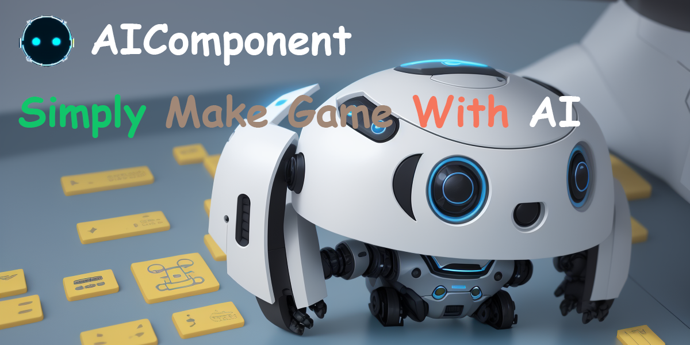

[**中文**](./README.md) | [**English**](./README_EN.md)

# AIComponent: 集成各种先进AI自动创建游戏组件

## 功能列表：

1. Script 集成ChatGPT自动生成游戏逻辑，为选中游戏对象添加行为
2. Shape  集成Shap-e自动生成3d造型，并设置好材质，自动加入场景
3. Image 集成Stable Diffusion 游戏2D素材

## 使用方法

下载本项目后复制 Assets/Editor 目录到项目对应文件夹下即可
